<div align="center">
  
</div>

<div align="center">
  
</div>

<div align="center">
  
  &nbsp;
  <a href="https://abdubakr77.github.io">
    
  </a>
</div>

<br/>

<div align="center">

| [](https://linkedin.com/in/abdubakr) | [](https://kaggle.com/abdullahbakr7) | [](https://pypi.org/user/AbduBakr) | [](https://github.com/abdubakr77) | [](https://orcid.org/0009-0009-1638-4356) |
|---|---|---|---|---|

</div>

<br/>

---

## 🚀 About Me


- 🎓 Studying **Information Systems** at Science Valley Academy: a program built around software development, databases, and systems design
- 💼 **ML Engineering Intern @ FlyRank AI**, selected from 20,000+ applicants worldwide, completed all 11 core assignments plus a capstone project, currently in final review
- 🧑‍💻 **Freelance For AI**: certified through the ITIDA Gigs × eYouth freelance training program
- 🔬 **AI Research**: NIH Chest X-Ray multi-label classification preprint submitted to Research Square, currently under review
- 📦 **Open Source**: [deepcsv](https://pypi.org/project/deepcsv/) · 16,000+ downloads on PyPI
- 📈 Ranked **#8 in Egypt** for AI & ML Engineering creators | Favikon (June 2026)
- 🏆 **15+ shipped projects** in ML, medical AI, computer vision, and deep learning
- 🌱 **Next up**: exploring Pose Estimation, OCR, and NLP
- 📫 Reach me at **abdullah.bakr.official@gmail.com**
- 🌍 Monufiya, Egypt

<br clear="right"/>

---

## 🎓 Education

**Information Systems**: Science Valley Academy *(High Institute for Engineering and Technology, Faculty of Science)*

📅 [Sep 2025 – Jun 2029] &nbsp;|&nbsp; 🎯 Grade: Very Good

---

## ⚡ Currently

```python
current_status = {
    "internship":  "ML Engineering Intern @ FlyRank AI (Jun 2026 – Present)",
    "research":    "NIH ChestX-Ray14 | Swin Transformer V2-B | 0.8495 mean AUC | preprint under review",
    "open_source": "deepcsv | PyPI | 16,000+ downloads",
    "learning":    "Pose Estimation | OCR | NLP",
    "open_to":     "AI/ML internships & full-time roles",
}
```

---

## 🏗️ Featured Projects

<div align="center">

| Project | Highlights | Stack |
|:--------|:-----------|:------|
| 🔬 **[NIH Chest X-Ray Classification](https://github.com/abdubakr77/chest-xray-multilabel-classification)** 🔒 | 5 architectures benchmarked · 112K+ images · **0.8495 mean AUC** · Swin V2-B surpasses CheXNet · Grad-CAM explainability · preprint under review at Research Square · *(private — embargoed pending publication)* | PyTorch, Swin Transformer, Grad-CAM |
| 🎭 **[Synthetic Image Attribution · ICANN 2026](https://github.com/abdubakr77/synthetic-image-attribution)** | Dual-stream EfficientNet-B4 · RGB + SRM forensic features · **95%+ accuracy** across 10 text-to-image models | PyTorch, EfficientNet |
| 🩺 **[Skin Lesion Segmentation](https://github.com/abdubakr77/skin-lesion-segmentation)** | YOLO-based segmentation · melanoma vs. non-melanoma · trained on University of Waterloo VIP Lab dermatological datasets | PyTorch, YOLO |
| 🦷 **[Dental X-Ray AI](https://github.com/abdubakr77/dental-xray-ai)** | Three-stage pipeline · quadrant detection → tooth enumeration → pathology classification (caries, periapical lesions, impacted teeth) | YOLO, Object Detection |
| 🚁 **[Drone Detection in the Wild](https://github.com/abdubakr77/yolo-drone-detector)** | YOLO26m + ResNet50 two-stage pipeline · **91.8% mAP@50** · 1,000+ real-world images | Ultralytics, Keras |
| 🎗️ **[Breast Cancer Classification](https://github.com/abdubakr77/cancer-classification-TensorFlow)** | ResNet50 vs VGG16 vs EfficientNetB4 vs InceptionV3 vs MobileNet · **98.5% val acc** · ultrasound images | TensorFlow, Keras |
| 😴 **[Drowsiness Detection](https://github.com/abdubakr77/drowsiness-detection-eye-state-classification)** | Real-time awake/sleepy classification · transfer learning on ~85K infrared eye images (MRL Eye Dataset) | PyTorch, Transfer Learning |
| 📦 **[deepcsv](https://github.com/abdubakr77/deepcsv)** · *PyPI* | Auto data cleaning · **16,000+ downloads** · GradientBoosting auto-feature-selection mode | Python, Pandas |

</div>

<details>
<summary>📂 More Projects</summary>
<br>

| Project | Highlights |
|:--------|:-----------|
| [FaceAge-Classifier](https://github.com/abdubakr77/FaceAge-Classifier) | 5-class age group classification (18–60) · CNN & transfer learning on 69K+ face images |
| [IBM Stock Forecasting](https://github.com/abdubakr77/IBM-Stock-Forecasting-RNN-LSTM-GRU) | Time series forecasting (1980–2025) comparing Vanilla RNN, LSTM, and GRU |
| [Stellar Object Classification](https://github.com/abdubakr77/predicting-stellar-class) | Multi-class classification (Galaxy/Star/Quasar) · stacked ensemble of LightGBM, XGBoost, ExtraTrees on SDSS17 data |
| [Garbage Classification](https://github.com/abdubakr77/garbage-classification-inception-v3) | 6-category classification · Inception V3 vs ResNet50 vs EfficientNet-B3 |
| [Intel Image Classification](https://github.com/abdubakr77/intel-image-classification-cnn) | Multi-class CNN classification on the Intel Image dataset |
| [Cats vs Dogs Classifier](https://github.com/abdubakr77/Cats-vs-Dogs-Image-Classification-98-Acc) | Transfer learning · **~98% test acc** · ResNet50 + augmentation |
| [Weather Temperature Prediction](https://github.com/abdubakr77/Weather-Temperature-Prediction) | Gradient Boosting regression · R² = 0.687 |
| [Iris Flower Classification](https://github.com/abdubakr77/Iris-Flower-Classification) | Classic ML pipeline comparing multiple classifiers with scikit-learn |
| Dental Age Estimation *(private)* | Age estimation from panoramic cropped radiographs via transfer learning |
| [FlyRank ML Internship Workspace](https://github.com/abdubakr77/flyrank-ml-internship) | Notebooks, pipeline work, and capstone project from the FlyRank AI internship |

</details>

---

## 🛠️ Tech Stack

**Deep Learning Frameworks**

| TensorFlow | Keras | PyTorch |
|:----------:|:-----:|:-------:|
| <a href="https://www.tensorflow.org" target="_blank"></a> | <a href="https://keras.io" target="_blank"></a> | <a href="https://pytorch.org/" target="_blank"></a> |

**Computer Vision and ML**

| OpenCV | Scikit-learn | NumPy | Pandas | SciPy |
|:------:|:------------:|:-----:|:------:|:-----:|
| <a href="https://opencv.org/" target="_blank"></a> | <a href="https://scikit-learn.org/" target="_blank"></a> | <a href="https://numpy.org/" target="_blank"></a> | <a href="https://pandas.pydata.org/" target="_blank"></a> | <a href="https://scipy.org/" target="_blank"></a> |

**Specialized: Object Detection & Gradient Boosting**

| Ultralytics | XGBoost | LightGBM |
|:-----------:|:-------:|:--------:|
| <a href="https://www.ultralytics.com/" target="_blank"></a> | <a href="https://xgboost.ai/" target="_blank"></a> | <a href="https://lightgbm.readthedocs.io/" target="_blank"></a> |

**Visualization**

| Matplotlib | Seaborn |
|:----------:|:-------:|
| <a href="https://matplotlib.org/" target="_blank"></a> | <a href="https://seaborn.pydata.org/" target="_blank"></a> |

**Tools and Environment**

| Python | Jupyter | VS Code | Git | Kaggle |
|:------:|:-------:|:-------:|:---:|:------:|
| <a href="https://www.python.org" target="_blank"></a> | <a href="https://jupyter.org/" target="_blank"></a> | <a href="https://code.visualstudio.com/" target="_blank"></a> | <a href="https://git-scm.com/" target="_blank"></a> | <a href="https://kaggle.com/abdullahbakr7" target="_blank"></a> |

---

## 📊 GitHub Analytics

<div align="center">
  
  &nbsp;&nbsp;
  
</div>

---

## 🗣️ Recommendation

> "I highly recommend Abdullah. He is a hardworking and consistent professional. We collaborated on a research paper together, and it was a pleasure working with him. He completed his part of the work within the given deadline. Abdullah has excellent programming skills in both Machine Learning and Deep Learning. I would recommend him for any AI-related project, particularly those involving Computer Vision or Large Language Models (LLMs)."
>
> — **[Dr. Ashraf Ullah](https://www.linkedin.com/in/dr-ashraf-ullah-96b9aaa3/)**, Research Collaborator · July 2026

---

## 🌐 Languages

| Language | Proficiency |
|:---------|:------------|
| 🇪🇬 Arabic | Native or bilingual proficiency |
| 🇬🇧 English | Professional working proficiency |

---

## 📜 Certifications

- 🧠 **HCIA-AI V4.0** · Huawei ICT Academy (Aug 2026)
- 🤝 **AI Ambassadors Program** · National Telecommunication Institute (NTI) × Engineers for a Sustainable Egypt (Jul 2026)
- 💻 **Freelancing Certification** · ITIDA Gigs × eYouth (2026)
- 🚀 **Build with AI: Masr Edition** · Google for Developers (2026)
- 👁️ **Deep Learning for Computer Vision** · MaharaTech / ITI (2026)
- ☁️ **AWS AI Practitioner Challenge** · Udacity (2026)

---

<div align="center">
  
</div>
